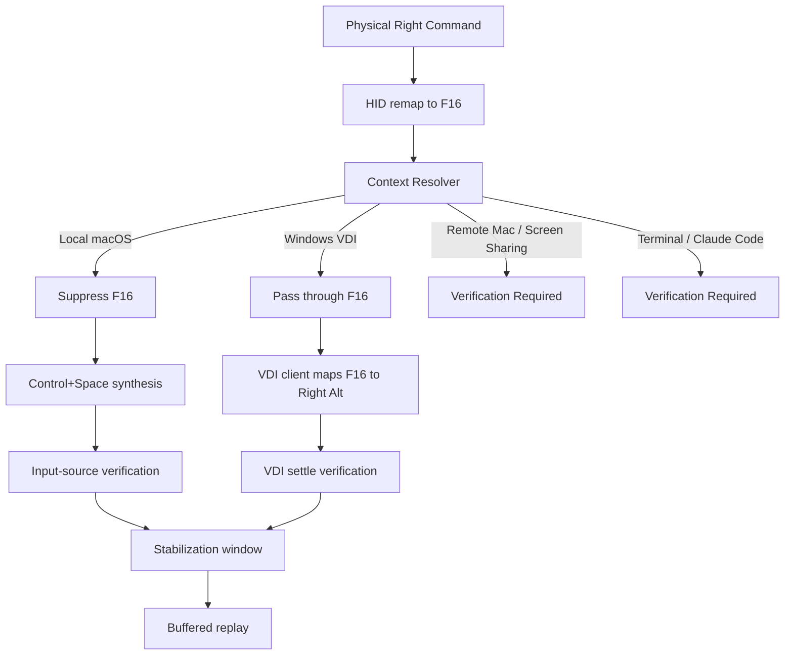
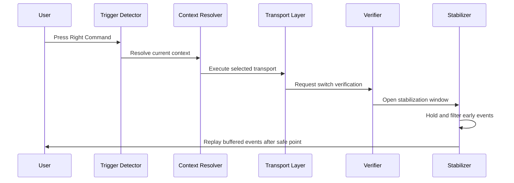

# IME Switching Architecture

## 1. Architecture Goal

Keep the trigger simple and move complexity into explicit context and stabilization stages.

The target model is:

`Right Command -> Context Resolver -> Transport -> Verification -> Stabilization -> Replay`

---

## 2. Top-Level Runtime Flow

---

## 3. Context Model

### Contexts

1. **Local macOS**
2. **Windows VDI**
3. **Remote Mac / Screen Sharing**
4. **Terminal / Claude Code**

### Rule

The trigger key does not directly select the switching mechanism.

The resolver selects the mechanism.

---

## 4. Transport Model

### Transport A — Local macOS

- input: Right Command
- internal relay: F16
- action: suppress F16 and synthesize `Control+Space`

### Transport B — Windows VDI

- input: Right Command
- internal relay: F16
- action: pass F16 through to the VDI client
- external dependency: VDI client maps `F16 -> Right Alt`

### Transport C — Remote Mac / Screen Sharing

- status: unresolved
- rule: do not assume Local macOS transport is sufficient until tested

### Transport D — Terminal / Claude Code

- status: mitigation added
- rejected experiment: terminal-like apps disabled the HID `Right Command -> F16` remap and used bare Right Command tap detection before direct input-source switching
- current mitigation: keep the F16 boring-key trigger, suppress it locally, and use direct input-source switching for terminal-like apps to avoid replay-induced paste overlays
- remaining work: runtime verification is still required in Ghostty and similar terminal apps

### Terminal Regression Guardrail

The following design is explicitly unsafe in terminal-like apps and must not be treated as an acceptable final architecture:

- disable `Right Command -> F16` HID remap
- detect bare Right Command via `flagsChanged`
- rely on `NSEvent` global monitor to observe the tap
- allow the app to still see a live Command modifier

Reason:

- `NSEvent` global monitor is observer-only
- it does not suppress the Command event
- Ghostty and similar terminal apps can then trigger shortcuts or raw protocol output

---

## 5. Stabilization Pipeline

### Stabilization responsibilities

- enforce minimum hold windows where needed
- prevent early replay
- prevent modifier contamination in VDI
- prevent stray terminal/prompt output in terminal-like contexts

---

## 6. Ownership Boundaries

### App-owned

- Right Command trigger path
- context resolution
- F16 relay path
- `Control+Space` synthesis path
- replay timing and verification

### System-owned

- Caps Lock default behavior
- macOS input-source settings
- VDI client mapping behavior outside the app

---

## 7. Inline SVG: Ownership Model

<svg width="760" height="210" viewBox="0 0 760 210" xmlns="http://www.w3.org/2000/svg" role="img" aria-label="Ownership model diagram">
  <rect x="20" y="30" width="220" height="120" rx="12" fill="#1f2937" stroke="#60a5fa"/>
  <text x="40" y="60" fill="#e5e7eb" font-size="18" font-family="Arial">App-owned path</text>
  <text x="40" y="92" fill="#cbd5e1" font-size="14" font-family="Arial">Right Command</text>
  <text x="40" y="114" fill="#cbd5e1" font-size="14" font-family="Arial">F16 relay</text>
  <text x="40" y="136" fill="#cbd5e1" font-size="14" font-family="Arial">Control+Space / VDI pass-through</text>

  <rect x="280" y="30" width="200" height="120" rx="12" fill="#1f2937" stroke="#34d399"/>
  <text x="300" y="60" fill="#e5e7eb" font-size="18" font-family="Arial">Boundary</text>
  <text x="300" y="92" fill="#cbd5e1" font-size="14" font-family="Arial">Context resolution</text>
  <text x="300" y="114" fill="#cbd5e1" font-size="14" font-family="Arial">Verification</text>
  <text x="300" y="136" fill="#cbd5e1" font-size="14" font-family="Arial">Stabilization</text>

  <rect x="520" y="30" width="220" height="120" rx="12" fill="#1f2937" stroke="#f59e0b"/>
  <text x="540" y="60" fill="#e5e7eb" font-size="18" font-family="Arial">System-owned path</text>
  <text x="540" y="92" fill="#cbd5e1" font-size="14" font-family="Arial">Caps Lock</text>
  <text x="540" y="114" fill="#cbd5e1" font-size="14" font-family="Arial">macOS input-source settings</text>
  <text x="540" y="136" fill="#cbd5e1" font-size="14" font-family="Arial">VDI client key mapping</text>

  <line x1="240" y1="90" x2="280" y2="90" stroke="#94a3b8" stroke-width="2"/>
  <line x1="480" y1="90" x2="520" y2="90" stroke="#94a3b8" stroke-width="2"/>
</svg>

---

## 8. Architecture Constraints

- Do not add Right Option back into the trigger path.
- Do not route IME switching through Caps Lock.
- Do not document unresolved contexts as solved.
- Do not tune replay timing before trigger scope and context rules are simplified.
- Do not implement terminal switching with bare Right Command `flagsChanged` on top of observer-only `NSEvent` monitoring unless real Command leakage is proven impossible.

---

## 9. Implementation Notes

This document intentionally does not define code-level symbol names.

It defines the system contract that code must follow.
